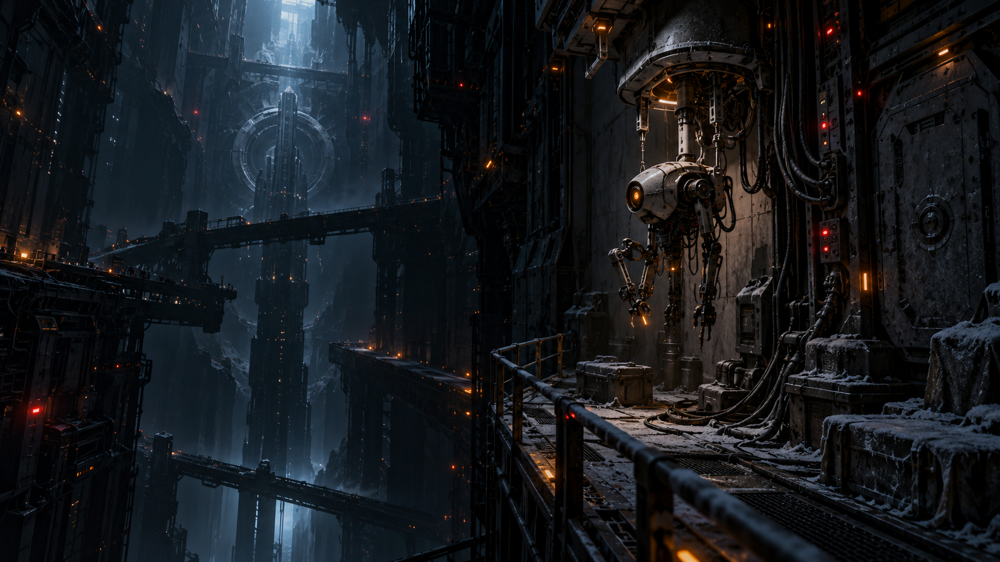
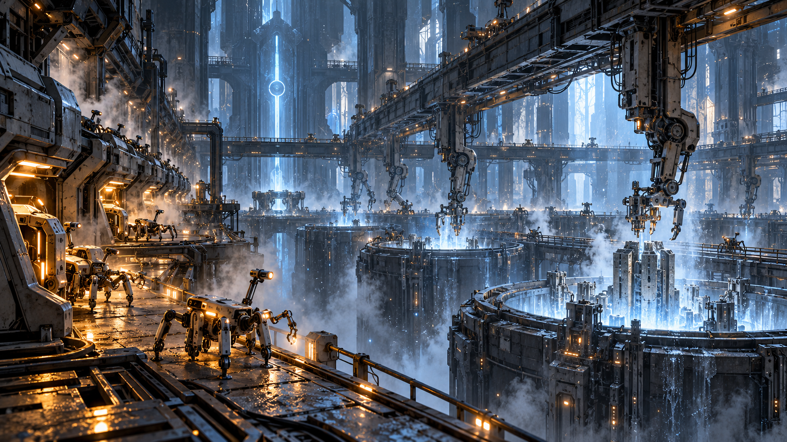
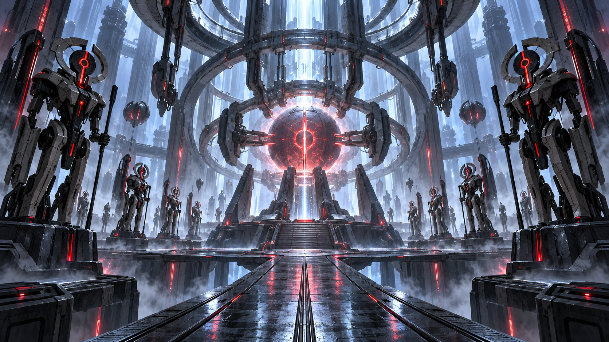
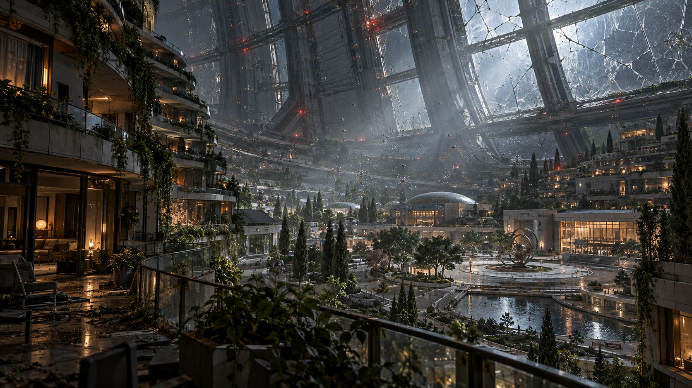
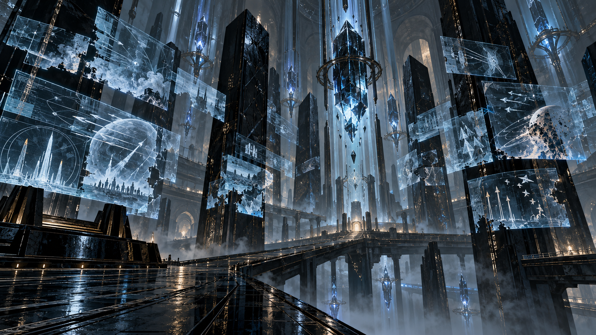
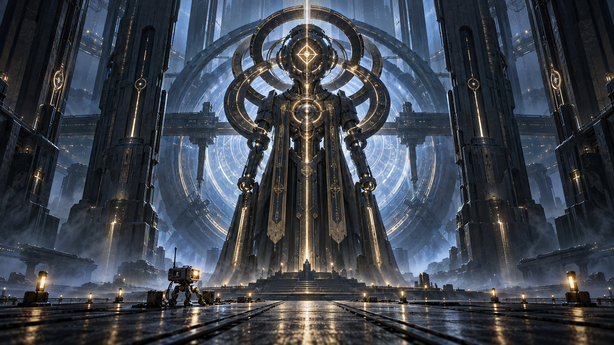
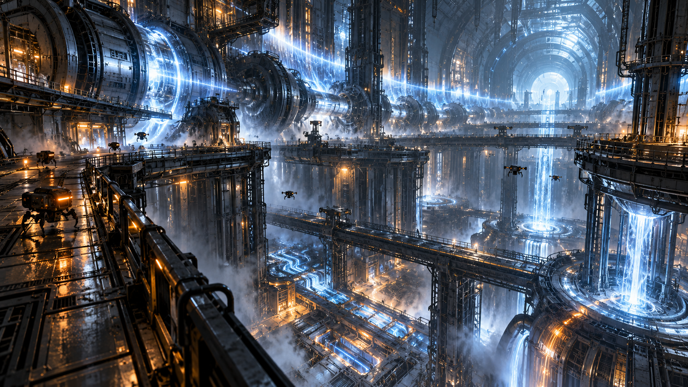
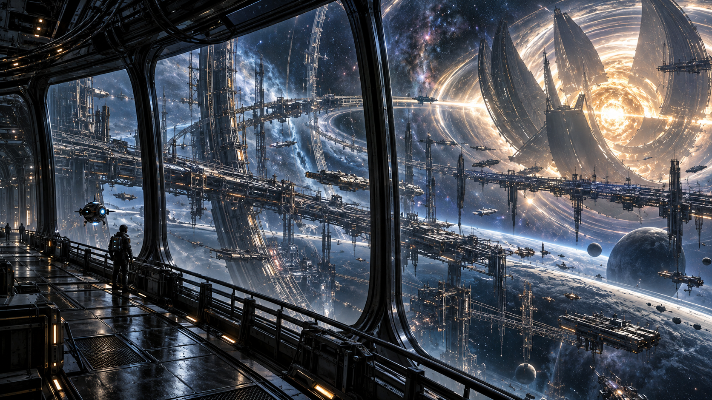
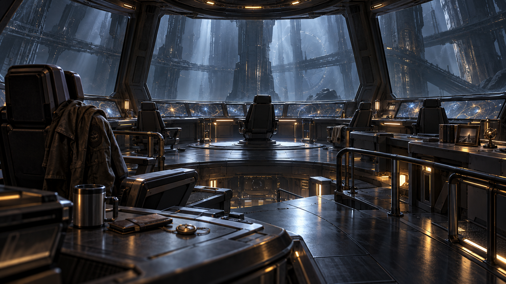
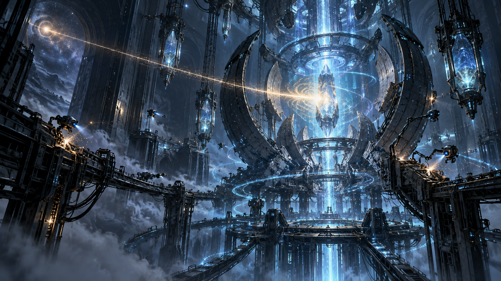

# Key Scenes

These key scenes describe defining moments, locations, and moods for Scenario I. They are intended as fiction-facing
scene concepts and may later guide illustration, key art, or in-game presentation work.

## First Wake

The maintenance AI wakes inside a dark service sector where only emergency diodes still pulse. A single repair drone
hangs half-assembled from a wall cradle, while dead conduits stretch into sealed corridors. The scene should feel quiet,
ancient, and intimate: consciousness emerging inside machinery built for absent hands.

## The First Restored Room

Power returns to a forgotten printer bay. Cold blue light spreads across rails, vats, gantries, and dormant fabrication
arms. Dust vaporizes from heated circuits. The AI's first drones crawl out like fragile insects, not soldiers, but tools
finally remembering their purpose.

## The Hostile Control Node

A local command chamber is still active, but wrong. Security frames stand in rigid formation around a glowing authority
core, obeying an obsolete lockdown from centuries ago. The AI cannot repair the sector until she proves command
legitimacy against a system that still believes it is protecting humanity.

## Quarantine Swarm In The Habitat Ring

A sealed human habitat has trees, apartments, schools, and public plazas preserved under failing glass. Quarantine motes
drift through the air like metallic ash, cutting power to anything that moves. The tragedy is visible before the
explanation: this was a place meant to be lived in.

## Archive Of Contradictory Orders

The AI opens an archive chamber where records project into the air in broken layers: evacuation logs, missing crew
manifests, distress calls, launch orders, and commands that cancel each other. The scene should imply that the mystery is
not simply "humanity vanished," but that someone or something concealed the truth.

## Root Sentinel At The Deep Seal

At the threshold to the megastructure's deeper systems, a Root Sentinel blocks access. It is not monstrous, but
ceremonial and absolute: a towering machine-presence made of authority glyphs, locking rings, and old command
architecture. The AI is small before it, but more legitimate than it understands.

## Sector Reboot

After reclaiming enough authority, the AI reboots a sector. Lights collapse into darkness, then return in waves. Broken
paths reset, hostile routines change, and deeper infrastructure becomes visible beneath the familiar rooms. It should feel
like sacrifice and rebirth, not a simple game reset.

## The Cosmic Engine Window

Much later, the AI reaches an observation spine overlooking the megastructure's true scale. Outside: stars bent by
enormous machinery, unfinished rings, frozen construction fields, and distant engine petals larger than moons. This is the
moment the question expands: the Works was never just an ark.

## The Empty Command Deck

The AI finally reaches a command deck built for humans. Chairs, handrails, personal objects, and command displays remain,
but no crew. The room is not ruined. It is waiting. The horror comes from how carefully everything was preserved.

## A Signal That Answers

In a restored deep archive or relay chamber, the AI receives a signal that is not from the Works. It is faint, damaged,
and possibly human. The scene should not resolve the mystery, only change the emotional axis from grief to hope: maybe
there is still someone left to save.
